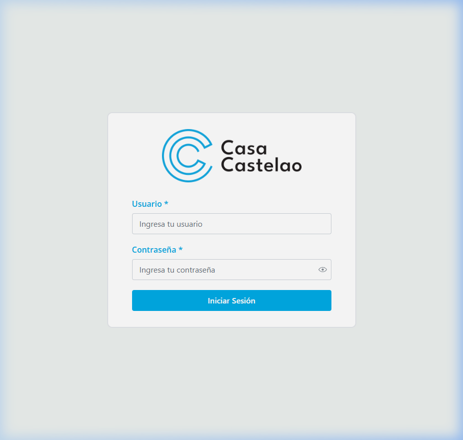
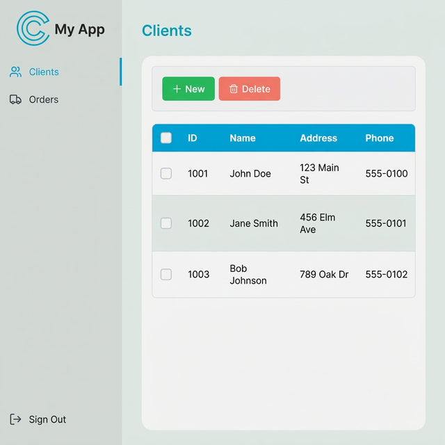
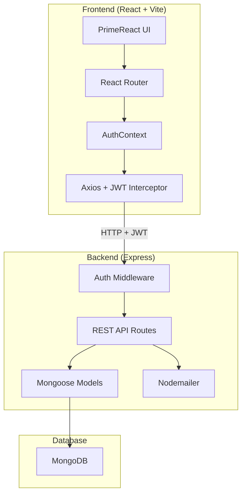

<div align="center">

# 🚀 fullstack-crud

**Scaffold a production-ready full-stack CRUD application in seconds.**

TypeScript · React · Express · MongoDB · Zod · Docker

[](https://github.com/DanteCastelao/fullstack-crud/actions)
[](https://opensource.org/licenses/MIT)
[](https://nodejs.org)
[](CONTRIBUTING.md)

---

[Features](#-features) · [Quick Start](#-quick-start) · [Architecture](#-architecture) · [Configuration](#-configuration) · [Tech Stack](#-tech-stack) · [Contributing](#-contributing)

</div>

---

## ✨ Features

| Feature | Description |
|---------|------------|
| 🔐 **JWT Authentication** | Secure login with cookie + Bearer token dual support |
| 👮 **Role-Based Access** | Admin and user roles with typed middleware guards |
| 🎨 **Customizable Theming** | Brand colors, background, and PrimeReact overrides — all configurable |
| 📊 **PrimeReact DataTables** | Sortable, filterable, paginated data grids out of the box |
| 📱 **Responsive Sidebar** | Desktop sidebar + mobile drawer with PrimeReact |
| 🔒 **Security Hardened** | Helmet, rate limiting, Zod request validation, centralized error handling |
| 📧 **Email Notifications** | Gmail/nodemailer integration for events |
| 📄 **PDF Processing** | Upload, parse, and download PDF documents |
| 📈 **Excel Export** | Client-side XLSX export via `xlsx` + `file-saver` |
| 🐳 **Docker Ready** | Multi-stage Dockerfile + docker-compose with health checks |
| ⚡ **TypeScript** | Strict mode, shared types, full type safety across the stack |
| 🧪 **Tested** | CLI + template validation tests using Node’s built-in test runner |

---

## 📸 Screenshots

<div align="center">

| Login | Data Table |
|:-----:|:----------:|
|  |  |

*All colors, titles, and branding are fully customizable through the interactive CLI.*

</div>

---

## 🚀 Quick Start

### 1. Clone and run the generator

```bash
git clone https://github.com/DanteCastelao/fullstack-crud.git
cd fullstack-crud
npm install
npm run create
```

The interactive CLI will guide you through:

```
╔══════════════════════════════════════════════════╗
║            fullstack-crud  v1.0.0                ║
║   Full-Stack CRUD App Generator                  ║
║   React · Express · MongoDB · PrimeReact         ║
╚══════════════════════════════════════════════════╝

? Project name: my-app
? Application title: My App
? Brand color (hex): #00ABE6
? Select features: Email, PDF, Excel
```

### 2. Start the backend

```bash
cd my-app/backend
cp .env.example .env   # Edit with your MongoDB URI, JWT secret, etc.
npm install
node seed.js           # Create initial admin user
npm start
```

### 3. Start the frontend

```bash
cd my-app/frontend
npm install
npm run dev
```

### 4. Open your browser

Navigate to `http://localhost:5173` and log in with:

| Field | Value |
|-------|-------|
| Username | `admin` |
| Password | `admin123` |

> ⚠️ **Change the default password after first login!**

---

## 🏗 Architecture



### Project Structure

```
my-app/
├── docker-compose.yml           # MongoDB + backend containers
├── backend/
│   ├── tsconfig.json            # Strict TypeScript config
│   ├── Dockerfile               # Multi-stage production build
│   ├── .env.example
│   └── src/
│       ├── server.ts            # Express (helmet, rate-limit, error handler)
│       ├── seed.ts              # Admin user seeder
│       ├── types/index.ts       # Shared TypeScript types
│       ├── utils/env.ts         # Zod environment validation
│       ├── middleware/
│       │   ├── auth.ts          # JWT verification (cookie + Bearer)
│       │   ├── admin.ts         # Admin role guard
│       │   ├── role.ts          # Dynamic role guard
│       │   ├── errorHandler.ts  # AppError class + centralized handler
│       │   └── validate.ts      # Zod request schema validation
│       ├── models/User.ts       # Typed Mongoose model
│       └── routes/
│           ├── auth.ts          # Login / Logout / Role check
│           └── users.ts         # User CRUD
│
└── frontend/
    ├── tsconfig.json            # Strict React TypeScript
    ├── vite.config.ts           # Dev proxy → backend
    ├── tailwind.config.js       # Brand color config
    ├── postcss.config.js
    └── src/
        ├── main.tsx             # React entry
        ├── App.tsx              # App (wrapped in ErrorBoundary)
        ├── index.css            # Global theme + PrimeReact overrides
        ├── axios.ts             # Typed Axios + JWT interceptor
        ├── context/AuthContext.tsx
        ├── routes/AppRouter.tsx  # Protected routes + 404
        └── components/
            ├── Login/           # Login page
            ├── Sidebar/         # Responsive sidebar
            ├── ErrorBoundary/   # React error boundary
            └── pages/
                ├── Dashboard/   # Dashboard landing
                └── NotFound/    # 404 page
```

---

## ⚙️ Configuration

### CLI Options

| Option | Description | Default |
|--------|-------------|---------|
| `Project name` | Directory name for the new project | `my-crud-app` |
| `Application title` | Displayed in sidebar, login, and page title | `My App` |
| `Brand color` | Primary theme color (hex) | `#00ABE6` |
| `Brand color dark` | Hover/active variant | `#0095c8` |
| `Brand color light` | Highlight/selection variant | `#d4f1f9` |
| `Background color` | Page background | `#EDF1EF` |
| `Features` | Email, PDF, Excel toggle | All enabled |
| `Admin email` | Notification recipient | `admin@example.com` |

### Environment Variables

#### Backend (`.env`)

| Variable | Description | Example |
|----------|-------------|---------|
| `PORT` | Server port | `5000` |
| `MONGODB_URI` | MongoDB connection string | `mongodb://localhost:27017/myapp` |
| `JWT_SECRET` | JWT signing secret | `my-super-secret-key` |
| `EMAIL` | Gmail sender address | `you@gmail.com` |
| `EMAIL_PASSWORD` | Gmail App Password | `abcd efgh ijkl mnop` |
| `NODE_ENV` | Environment | `development` |

> 📖 For deployment instructions, see [docs/CONFIGURATION.md](docs/CONFIGURATION.md).

---

## 🛠 Tech Stack

<table>
<tr>
<td align="center"><strong>Frontend</strong></td>
<td align="center"><strong>Backend</strong></td>
<td align="center"><strong>Tools</strong></td>
</tr>
<tr>
<td>

- React 18
- Vite 5
- PrimeReact 10
- TailwindCSS 3
- React Router 6
- Axios
- Lucide Icons
- **TypeScript 5**

</td>
<td>

- Node.js
- Express 4
- Mongoose 8
- JWT (jsonwebtoken)
- bcryptjs
- **Zod**
- **Helmet**
- **express-rate-limit**
- Nodemailer

</td>
<td>

- **TypeScript 5**
- MongoDB
- **Docker**
- GitHub Actions CI
- Node.js Test Runner
- ESLint
- CSS Modules

</td>
</tr>
</table>

---

## 🤝 Contributing

Contributions are welcome! Please read the [Contributing Guide](CONTRIBUTING.md) first.

1. Fork the repository
2. Create your feature branch (`git checkout -b feature/amazing-feature`)
3. Commit your changes (`git commit -m 'Add amazing feature'`)
4. Push to the branch (`git push origin feature/amazing-feature`)
5. Open a Pull Request

---

## 📄 License

This project is licensed under the MIT License — see the [LICENSE](LICENSE) file for details.

---

<div align="center">

**Made with ❤️ by [Dante Castelao](https://github.com/DanteCastelao)**

</div>
