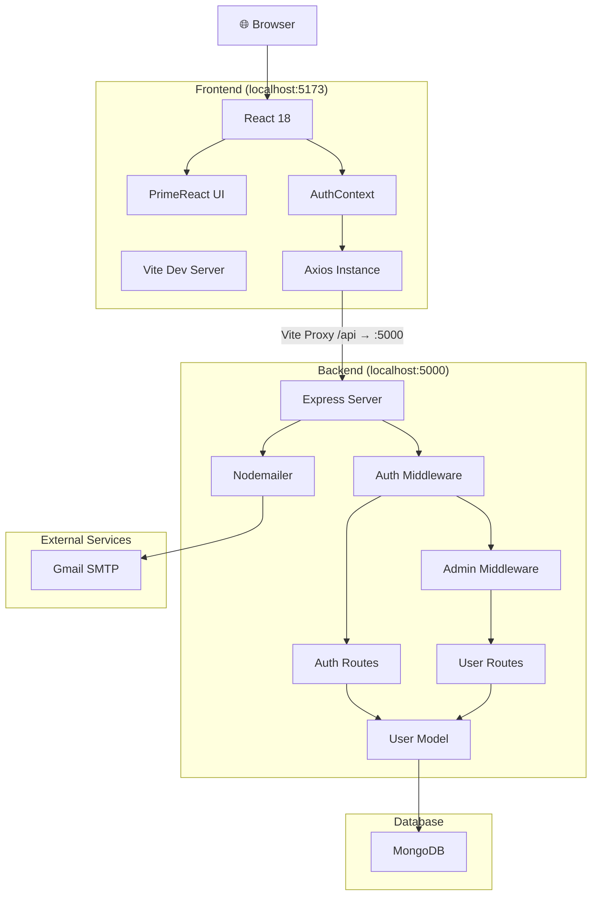
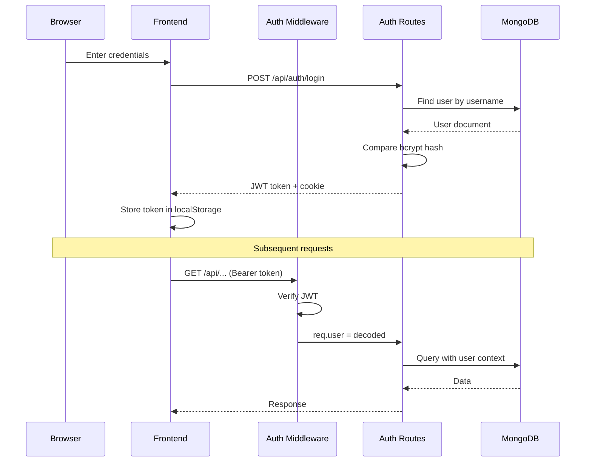
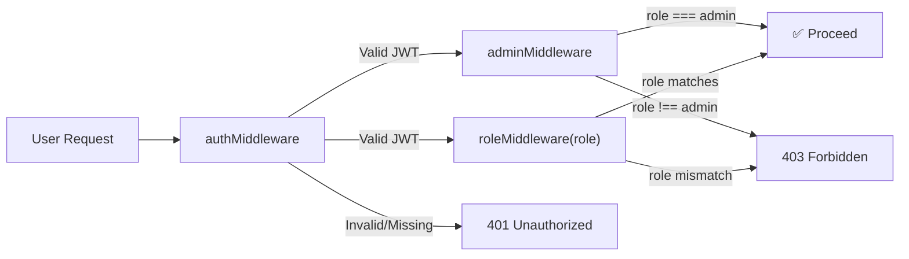

# Architecture

## System Overview

```mermaid
graph TB
    Browser["🌐 Browser"]
    
    subgraph Frontend["Frontend (localhost:5173)"]
        React["React 18"]
        Vite["Vite Dev Server"]
        PrimeReact["PrimeReact UI"]
        AuthCtx["AuthContext"]
        AxiosInst["Axios Instance"]
    end
    
    subgraph Backend["Backend (localhost:5000)"]
        Express["Express Server"]
        AuthMW["Auth Middleware"]
        AdminMW["Admin Middleware"]
        AuthR["Auth Routes"]
        UserR["User Routes"]
        UserModel["User Model"]
        Nodemailer["Nodemailer"]
    end
    
    subgraph Database["Database"]
        MongoDB["MongoDB"]
    end
    
    subgraph External["External Services"]
        Gmail["Gmail SMTP"]
    end
    
    Browser --> React
    React --> PrimeReact
    React --> AuthCtx
    AuthCtx --> AxiosInst
    AxiosInst -->|"Vite Proxy /api → :5000"| Express
    Express --> AuthMW
    AuthMW --> AuthR
    AuthMW --> AdminMW
    AdminMW --> UserR
    AuthR --> UserModel
    UserR --> UserModel
    UserModel --> MongoDB
    Express --> Nodemailer
    Nodemailer --> Gmail
```

## Authentication Flow

```mermaid
sequenceDiagram
    participant B as Browser
    participant F as Frontend
    participant A as Auth Middleware
    participant R as Auth Routes
    participant DB as MongoDB

    B->>F: Enter credentials
    F->>R: POST /api/auth/login
    R->>DB: Find user by username
    DB-->>R: User document
    R->>R: Compare bcrypt hash
    R-->>F: JWT token + cookie
    F->>F: Store token in localStorage
    
    Note over B,DB: Subsequent requests
    
    F->>A: GET /api/... (Bearer token)
    A->>A: Verify JWT
    A->>R: req.user = decoded
    R->>DB: Query with user context
    DB-->>R: Data
    R-->>F: Response
```

## Role-Based Access Control

```mermaid
graph LR
    User["User Request"]
    Auth["authMiddleware"]
    Admin["adminMiddleware"]
    Role["roleMiddleware(role)"]
    
    User --> Auth
    Auth -->|"Valid JWT"| Admin
    Auth -->|"Valid JWT"| Role
    Auth -->|"Invalid/Missing"| Deny1["401 Unauthorized"]
    Admin -->|"role === admin"| Allow["✅ Proceed"]
    Admin -->|"role !== admin"| Deny2["403 Forbidden"]
    Role -->|"role matches"| Allow
    Role -->|"role mismatch"| Deny2
```
